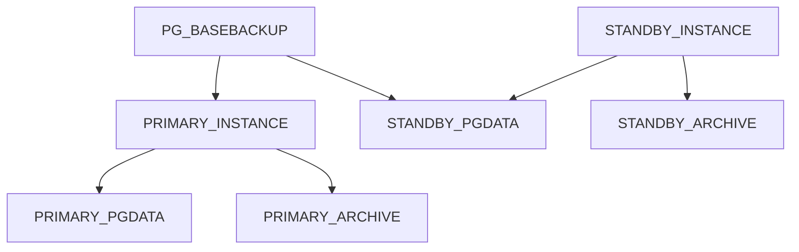

# PostgreSQL

## Deployment

To deploy the PostgreSQL server in a single you just runt the `deploy.sh` script,
but make sure you need to define the environment variable located under the `.env`
file first. The required information for the deployment are:

- `POSTGRES_IMAGE`: The docker image of the postgresql
- `POSTGRES_PORT`: Expose port to the host port
- `POSTGRES_USER`: Default user
- `POSTGRES_PASSWORD`: Default password
- `POSTGRES_DB`: Default database
- `POSTGRES_VOLUME_PATH`: Where the database data located
- `POSTGRES_ARCHIVE_PATH`: Where the database archive located.

> [!NOTE]
> The `POSTGRES_ARCHIVE_PATH` is required when we need to use the instance
> as primary server only. This serves the Replication architecture purpose
> which working with *WAL* (Write-Ahead Log) mechanism.

The following is the environment content of `.env` file as an example:

```bash
POSTGRES_IMAGE=postgres:18.1-alpine
POSTGRES_PORT=5432
POSTGRES_USER=admin
POSTGRES_PASSWORD=admin@IFNT1
POSTGRES_DB=default
POSTGRES_VOLUME_PATH=/var/data/postgresql
POSTGRES_ARCHIVE_PATH=/var/data/postgresql-archive
POSTGRES_DUMP_PATH=./dump
```

## Replication

For more detail about replication, please refer to the PostgreSQL documentation. Now,
we only describe step-by-step how to make replication works. Replication needs to have
at least two instances, one is *primary* and another one is *standby* (in read-only node).
But we can promote the *standby* instance as *primary* instance as well. The following
shows the illustration how the replication inter-connection works.



### Create replication user

To allow the replication takes place, it must be performed a user at *primary* instance
with `replication` privilege. So the follow will create a user name `user_replica`
with `replication` privilege:

```bash
# Log into the primary instance container
$> docker exec -it DOCKER_CONATINER_ID bash

# Create a new user with:
# - replication privilege
# - 5 currencent connections
# $> createuser -U [HOST_ADMIN_USER] -P -c 5 --replication user_replica
$> createuser -U admin -P -c 5 --replication user_replica

# OR
# Ass the script is ready setup you can
$> cd /docker-entrypoint-initdb.d
$> ./create-replica-user
```

### Enable WAL and Replication

There are many things to understand when come to the HA (High Availability) system,
so, please refer to the documentation from PostgreSQL for more detail especially
the WAL (Write-Ahead Log) and Archiving. The following is to enable the WAL
and archiving mode (`postgresql.conf`):

```bash
# /var/lib/postgresql/18/docker/postgresql.conf
wal_level = replica
max_wal_senders = 3
archive_mode = on
archive_command = 'test ! -f /mnt/server/archive/%f && cp %p /mnt/server/archive/%f'
```

### Enable Client Authentication

To allow the *standby* instance stream the replication data we need to allow
it in the `pg_hba.conf`. The following will allow `user_replica` to make
replication (`replication`) from any host (`0.0.0.0/0`) using using `md5` method.

```bash
# TYPE  DATABASE         USER           ADDRESS     METHOD
  host  replication     user_replica    0.0.0.0/0   md5
```

> [!NOTE]
> All any changes to the configuration file, the service restarting is required.
> ``$> sudo docker restart CONTAINER_ID``

After the `primary` instance restarted, you will see the archive log is written
in the pre-defined location (`/var/data/prostres-archive`) as the following as an
example:

```bash
$> ls -l /var/data/postgres-archive
total 32768
-rw------- 1 70 70 16777216 Oct 30 11:17 000000010000000000000001
-rw------- 1 70 70 16777216 Oct 30 11:18 000000010000000000000002
```

### Standby Server and Instance

To make the *standby* instance use the replicated data (streamed data), we need to
make sure that on the *standby* server, we have the postgresql installed by make sure
it doesn't start. If it's started, we need to stop it and clean all is data directory.
After that, pull or stream the data from *primary* instance and put it into the
postgresql data folder.

As we are using docker base deployment, first thing we need to do is to deploy
the postgresql image without starting it. By doing this, we set the command which
will effect the starting up the postgresql service.

> [!NOTE]
> As the *standby* instance need to have own and separated configuration,
> so make sure you define the environment variable properly which located
> in the `.env-standby` environment file. The following is the example of
> the environment variables required for the *standby* instance:

```bash
# .env-standby
POSTGRES_IMAGE=postgres:18.1-alpine
POSTGRES_PORT=5433
POSTGRES_VOLUME_PATH=/var/data/postgresql-standby # 0777
POSTGRES_ARCHIVE_PATH=/var/data/postgresql-standby-archive
POSTGRES_DUMP_PATH=./dump
```

#### Start postgresql container

Starting the postgresql container, just start the container only, and make sure
the postgresql service not up and running. This process is to make sure that
no postgresql data is created automatically, because we need to replace the
*standby* instance streams data from the *primary* instance. To stream the
*primary* instance data, we use built-in utility named ``pg_basebackup``.

Luckily, we already the script setup with `deploy-standby.sh` script. For more detail,
you can have a look on the script how to start the container only. The following command
is to start the container without postgresql service started:

> [!NOTE]
> The trick to start the container without staring the
> PosgreSQL server is to add the ``command: sleep infinity``

```bash
# Starts the postgresql container, without postgresql
# service up and running.
$> sudo ./deploy-standby.sh startup
```

#### Stream data from PRIMARY instance

To stream the data from *primary* instance, you need to login to the *standby* instance
and stream it. In our case, we use need to login into docker container and stream:

- ``DOCKER_CONTAINER_ID``: The docker container ID or service name
- ``PRIMARY_INSTANCE_HOST``: Host of *primary* instance (``common_postgres``).
- ``PRIMARY_INSTANCE_PORT``: Host port of the *primary* instance (`5432`).
- ``PRIMARY_REPLICA_USER``: User at the *primary* instance with `replication` privilege (``user_replica``).
- ``DATA_PATH``: The database location to be streamed to (`/var/lib/postgresql/18/docker`).

```bash
# Get into the docker container of the standby instance
$> sudo docker exec -it DOCKER_CONTAINER_ID bash
```

```bash
# In the standby instance, start streaming from primary server
$> pg_basebackup \
  -h PRIMARY_INSTANCE_HOST \
  -p PRIMARY_INSTANCE_PORT \
  -U PRIMARRY_REPLICA_USER \
  -D DATA_PATH -Fp -Xs -R
```

#### Start postgresql service

In the host-base installed posgtresql, you can simply start the postgresql service.
But, in our case, it's all under the container-base installation, and the
`deploy-standby.sh` has this function. Run the followint command to bring
the *standby* postgresql container with postgresql service up and running
using the streamed data from *primary* instance.

```bash
$> sudo ./deploy-instance.sh deploy
```

### Verify the replicated data

When the replication is done, we can verify by modifying any data on the *primary*
instance, and effected immediately at the *standby* instance. And, at the
*standby* instance, try to modify any record, then will be blocked, because
*standby* instance is in read-only mode.

### Promoting STANDBY to PRIMARY

In case the *primary* instance fails, we need to promote the *standby* instance
promoted as the *primary* instance. But, postgresql does not come with built-int
automated failover and recovery. So, to perform this, we need to a utility called
``pg_ctl`` which promotes the *standby* instance to *primary* instance. To acheive this,
the following steps are required:

1. Make sure the *primary* instance is totallly down
2. Access to the *standby* instance
3. Try to modify any data to make sure it's in *standby* mode (read-only)
4. Run the ``pg_ctl`` with ``postgresql`` user.

> [!WARNING]
> Please remember that, you cannot run the ``pg_ctl`` utility with ``root`` user at all,
> so, please make sure you perform with ``posgtres`` user.

```bash
# Get into the standby container
$> sudo docker exec -it DOCKER_CONTAINER_ID bash
```

```bash
# On the standy instance, Make sure this is really in
# standby mode (read-only) by modifying any record.
CREATE TABLE rep_test(id serial primary, name varhar);

# Run the pg_ctl using postgres user (cannot be root user)
$> runuser -u postgres -- pg_ctl promote

# Make sure if it's promoted as primary, by modifying
# some data/record successfully.
CREATE TABLE rep_test(id serial primary, name varhar);
```

> [!NOTE]
> After the *standby* instance promoted as the *primary* instance, 
> you need to make sure the accessing the promoted instance is
> accessabled by the application especially the port, instance name
> (when using container-base installation).

